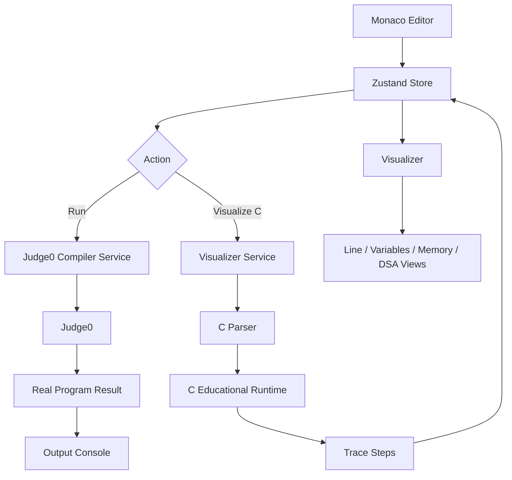

# CodeViz — Online Code Runner & C Data-Structure Visualizer

CodeViz is a React/Vite browser IDE built around two execution paths:

- **Judge0** is the authoritative compiler/runtime for the configured programming languages.
- **The native educational C runtime** produces deterministic source-level traces for C programs only.

This keeps real program execution separate from visualization: adding another Judge0 language never pretends that the language has C-style source tracing.

## Features

### Editor

- Monaco Editor with syntax highlighting.
- Multi-file projects with language-aware default filenames/extensions.
- Persistent code, files, active language, active file, and stdin in browser storage.
- **Format Code** in the Monaco right-click context menu.
- `Shift + Alt + F` formatting shortcut.
- `Ctrl/Cmd + Enter` to run.
- `Ctrl/Cmd + Shift + Enter` to visualize when C is selected.
- Responsive controls, including Reset on small screens.

### Judge0 execution

The editor includes the active Judge0 CE language presets documented in `JUDGE0.md`. Every configured language can be compiled/executed through Judge0; only C enables the source-level visualizer.

C multi-file projects use Judge0's Multi-file Program language with generated compile/run scripts. Other languages use their normal Judge0 language ID and can still submit additional project files where the Judge0 deployment supports them.

### C source-level visualization

For C, CodeViz builds deterministic execution steps containing data such as:

- current source line
- variables and values
- function calls and parameters
- call stack
- simulated stack/heap memory
- pointers and pointer targets
- allocations/frees
- stdout accumulated during execution
- execution notes

The visualizer also includes structure-aware views for arrays, matrices, linked structures, trees, hash tables, queues, and algorithm-oriented state.

### C / DSA coverage

The educational runtime is intended for conventional C implementations of:

- arrays and matrices
- stacks and queues
- circular queues and deques
- singly, doubly, and circular linked lists
- recursion and Tower of Hanoi
- binary trees and BSTs
- heaps / priority queues
- hash tables
- graph representations and traversal patterns
- sorting and searching
- Huffman-style trees
- common pointer/struct/malloc patterns used in DSA courses

The support page distinguishes the implemented educational model from the much larger set of C features that a real compiler accepts.

## Architecture



## Source layout

```text
src/
├── components/
│   ├── console/              # program output and errors
│   ├── editor/               # Monaco editor, file tabs, formatting action
│   ├── layout/               # application shell and responsive panels
│   ├── ui/                   # small reusable controls
│   └── visualizer/           # execution trace and DSA visualizations
├── config/
│   ├── languages.js          # language metadata, Judge0 IDs, starter code
│   └── support/c.js          # C educational support matrix
├── hooks/                    # responsive/browser hooks
├── pages/
│   ├── CompilerPage.jsx      # run/visualize orchestration
│   └── SupportPage.jsx       # language + C/DSA support documentation UI
├── services/
│   ├── interpreter/          # C parser and deterministic runtime
│   ├── judge0/               # real compiler/execution integration
│   ├── codeFormatter.js      # local formatting fallback
│   └── visualizerService.js  # trace orchestration
├── store/                    # Zustand editor/execution state
└── utils/                    # reusable browser utilities such as ZIP creation
```

## Execution contract

### Run

```text
Editor
  ↓
CompilerPage
  ↓
services/judge0/compilerService.js
  ↓
Judge0
  ↓
Output Console
```

### Visualize

```text
C Editor
  ↓
CompilerPage
  ↓
visualizerService.js
  ↓
interpreter/cParser.js
  ↓
interpreter/runtime.js
  ↓
trace steps
  ↓
Visualizer + DSAOverview
```

The visualizer is deliberately disabled for non-C languages. Judge0 execution and visualization are separate concerns.

## DSA repository compatibility

CodeViz was exercised against representative C implementations from `NirajBhattarai/DataStructureWithC`, including queue, linked list, recursion, Tower of Hanoi, sorting, searching, hashing, trees, BFS, and Huffman-style structures.

Important runtime compatibility fixes include:

- typed heap materialization for `malloc(sizeof(struct ...))`
- struct member access through `->`
- array parameter decay
- typed stack-array pointer arithmetic
- pointer writes through array-element addresses
- `sizeof(array) / sizeof(array[0])`
- C casts such as `(struct Node *)malloc(...)`
- circular queue wrap-around display

Repository documentation is not always an executable `.c` program. Therefore “supported” means the corresponding conventional C pattern is implemented in the educational runtime, not that every sentence or every possible compiler extension in the repository is automatically visualized.

## Configuration

Create `.env` from `.env.example`:

```env
VITE_JUDGE0_API_URL=https://ce.judge0.com
# VITE_JUDGE0_API_KEY=
```

See `JUDGE0.md` for the language mapping and deployment notes.

## Development

```bash
npm install
npm run dev
```

Production build:

```bash
npm run build
```

Lint:

```bash
npm run lint
```

## Design principle

CodeViz should be honest about the boundary between **real compilation** and **educational visualization**. A program may compile successfully in Judge0 while remaining outside the supported C visualization subset. Conversely, the visualizer must never be presented as the native compiler/runtime.
