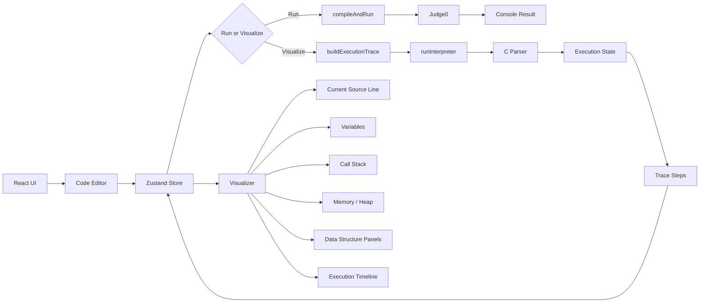

# CodeViz — Online C Compiler & Data Structure Visualizer

CodeViz is a browser-based **C programming, execution, and source-level visualization environment** built with React, Vite, Monaco Editor, Tailwind CSS, and Zustand.

It is designed primarily for **learning C, data structures, algorithms, pointers, memory, recursion, and program execution**. Users can write C programs, organize multi-file C projects, compile/run them through Judge0, and step through a deterministic educational execution trace that powers the visualizer.

---

## Project Goals

CodeViz combines two different responsibilities:

1. **Real C execution** — compile and run the program using Judge0's sandboxed compiler/runtime.
2. **Educational visualization** — execute supported C constructs through the local deterministic trace runtime and expose source lines, variables, stack, heap, pointers, call frames, and output as step-by-step state.

The separation is intentional: Judge0 is the authoritative result for whether the actual C program compiles and runs, while the visualization runtime provides the structured state needed to animate program execution.

---

## Core Workflow

```mermaid
flowchart TD
    A[User writes C code] --> B[Monaco C Editor]
    B --> C{User action}

    C -->|Run| D[compilerService.js]
    D --> E[Judge0 API]
    E --> F[Real GCC / C Runtime]
    F --> G[Execution Result]
    G --> H[Output Console]

    C -->|Visualize| I[visualizerService.js]
    I --> J[C Interpreter Runtime]
    J --> K[cParser.js]
    K --> L[Deterministic Execution]
    L --> M[Trace Steps]
    M --> N[Zustand Editor Store]
    N --> O[Visualizer]

    O --> P[Current Line]
    O --> Q[Variables]
    O --> R[Call Stack]
    O --> S[Memory / Heap]
    O --> T[Queue / Structure View]
    O --> U[Execution Timeline]
```



### Run flow

```text
C source
   ↓
CompilerPage
   ↓
compilerService.js
   ↓
Judge0
   ↓
GCC / sandboxed execution
   ↓
stdout + stderr + exit code + time + memory
   ↓
OutputConsole
```

### Visualization flow

```text
C source / C project
   ↓
CompilerPage
   ↓
visualizerService.js
   ↓
interpreter.js
   ↓
interpreter/runtime.js
   ↓
cParser.js
   ↓
execution state
   ↓
steps[]
   ↓
useEditorStore.js
   ↓
Visualizer.jsx
   ↓
line / variables / stack / heap / timeline / structures
```

---

## Logic Graph

The high-level application logic is:



---

## Main Features

### C Code Editor

- Monaco Editor-based coding experience.
- C syntax highlighting.
- C is the only selectable language.
- Default `main.c` C program.
- Multi-file project support.
- Create additional `.c` and `.h` files.
- Local project/file state management.
- Keyboard shortcuts for running and visualizing.

### Real C Compilation and Execution

Judge0 is used as the real execution engine.

- GCC/C execution through Judge0.
- Sandboxed program execution.
- Standard input support.
- Standard output/error capture.
- Exit-code handling.
- Execution time reporting.
- Memory information returned by Judge0.
- Multi-file C project compilation.
- C17 compilation for multi-file projects.
- Debug symbols are enabled for the native multi-file compiler command (`-g`).

### Source-Level Visualization

The visualizer produces deterministic execution steps for supported C programs.

Each step can contain information such as:

- Current source line.
- Variables and values.
- Local/global state.
- Function calls.
- Function parameters.
- Return values.
- Call stack.
- Simulated stack addresses.
- Simulated heap addresses.
- Pointer relationships.
- Allocated/freed memory.
- Standard output accumulated so far.
- Execution notes/errors.

### Execution Controls

The visualizer supports step-oriented execution including:

- Next step.
- Previous step.
- Play/pause execution.
- Execution timeline.
- Current source-line indication.
- Trace position/state tracking.

### Memory Visualization

The educational runtime models memory needed for common C data structures:

- Stack variables.
- Heap allocations.
- Pointers.
- Pointer arithmetic.
- Pointer-to-pointer relationships.
- Struct pointers.
- `malloc`, `calloc`, `realloc`, and `free`.
- Null pointers.
- Use-after-free diagnostics.
- Simulated deterministic addresses.

### Data Structure Visualization

The project is designed for common DSA implementations in C, including:

- Arrays.
- Dynamic arrays.
- Stack.
- Queue.
- Circular queue.
- Deque.
- Singly linked list.
- Doubly linked list.
- Circular linked list.
- Binary tree.
- Binary search tree.
- Heap / priority queue.
- Hash table.
- Graph adjacency matrix.
- Graph adjacency list.
- Trie.

The visualizer can expose general memory/pointer state even when a dedicated structure-specific panel is not available.

---

## C Language Support

The deterministic visualizer runtime supports a broad educational subset of C.

### Core language

| Feature | Status |
|---|---|
| Primitive types | Supported |
| Variables and scope | Supported |
| Expressions/operators | Supported |
| `if / else` | Supported |
| `switch / case` | Supported |
| `for` | Supported |
| `while / do-while` | Supported |
| `break / continue` | Supported |
| `return` | Supported |
| Functions and parameters | Supported |
| Recursion | Supported |
| `goto` / labels | Supported |
| Basic preprocessor handling | Supported |
| Variadic functions | Supported |

### Pointers and memory

| Feature | Status |
|---|---|
| Pointers | Supported |
| Pointer arithmetic | Supported |
| Pointer-to-pointer | Supported |
| Struct pointers / `->` | Supported |
| `NULL` | Supported |
| `malloc` / `calloc` | Supported |
| `realloc` | Supported |
| `free` | Supported |
| Use-after-free detection | Supported |
| Simulated stack addresses | Supported |
| Simulated heap addresses | Supported |
| Unions | Supported |
| Bit-fields | Supported |

### Structures and arrays

| Feature | Status |
|---|---|
| `struct` declarations | Supported |
| Nested structs | Supported |
| `typedef` | Supported |
| `enum` | Supported |
| Designated initializers | Supported |
| Self-referential nodes | Supported |
| Function pointers in structs | Supported |
| Flexible array members | Supported |
| 1D arrays | Supported |
| Multidimensional arrays | Supported |
| Array initializers | Supported |
| C strings | Supported |
| Pointer-to-array patterns | Supported |

### Common standard library support

The deterministic runtime provides models for commonly used functions from:

- `stdio.h`
- `stdlib.h`
- `string.h`
- `ctype.h`
- `math.h`

It includes common operations such as:

```text
printf / puts / putchar / fputs
scanf / sscanf (limited deterministic model)
malloc / calloc / realloc / free
strlen / strcpy / strcat / strcmp
strchr / strstr
memcpy / memmove / memset
atoi / atol / atoll / strto*
rand / srand
qsort / bsearch
```

File I/O is represented by a deterministic in-memory model for visualization rather than relying on the browser's filesystem.

---

## Algorithm Support

The runtime is suitable for tracing common algorithm implementations such as:

- Linear search.
- Binary search.
- Bubble sort.
- Selection sort.
- Insertion sort.
- Merge sort.
- Quick sort.
- Heap sort.
- Counting sort.
- Radix sort.
- BFS.
- DFS.
- Backtracking.
- Dynamic programming.
- Greedy algorithms.
- Dijkstra / shortest paths.
- Minimum spanning tree algorithms.

The project does not hard-code these algorithms. They are ordinary C programs whose control flow, variables, arrays, pointers, recursion, and memory operations are traced by the runtime.

---

## Multi-File C Projects

CodeViz supports projects such as:

```text
my-project/
├── main.c
├── math.c
├── math.h
└── stack.c
```

### Native execution

For multi-file projects, the Judge0 path creates a compilation environment and runs GCC over the C translation units.

Conceptually:

```text
main.c ─┐
math.c ─┼──→ gcc -std=c17 -O0 -g ──→ program ──→ Judge0
stack.c ─┘
```

### Visualization

The educational visualizer combines C source units into a deterministic source-level trace namespace. This is designed for visualization rather than replacing the native compiler/linker semantics.

---

## Project Structure

```text
vibedvisualizer/
│
├── public/
│   ├── favicon.svg
│   └── icons.svg
│
├── src/
│   │
│   ├── components/
│   │   ├── console/
│   │   │   └── OutputConsole.jsx
│   │   │
│   │   ├── editor/
│   │   │   └── CodeEditor.jsx
│   │   │
│   │   ├── layout/
│   │   │   ├── Header.jsx
│   │   │   └── Workspace.jsx
│   │   │
│   │   ├── ui/
│   │   │   ├── IconButton.jsx
│   │   │   └── Switch.jsx
│   │   │
│   │   └── visualizer/
│   │       ├── Visualizer.jsx
│   │       ├── CurrentLineIndicator.jsx
│   │       ├── ExecutionControls.jsx
│   │       ├── ExecutionTimeline.jsx
│   │       ├── VariablePanel.jsx
│   │       ├── MemoryPanel.jsx
│   │       ├── CallStack.jsx
│   │       ├── DSAOverview.jsx
│   │       └── QueuePanel.jsx
│   │
│   ├── config/
│   │   ├── languages.js
│   │   └── cSupport.js
│   │
│   ├── hooks/
│   │   └── useMediaQuery.js
│   │
│   ├── pages/
│   │   ├── CompilerPage.jsx
│   │   └── CProjectSupportPage.jsx
│   │
│   ├── services/
│   │   ├── compilerService.js
│   │   ├── visualizerService.js
│   │   ├── interpreter.js
│   │   ├── archive.js
│   │   └── interpreter/
│   │       ├── runtime.js
│   │       └── cParser.js
│   │
│   ├── store/
│   │   └── useEditorStore.js
│   │
│   ├── App.jsx
│   ├── main.jsx
│   └── index.css
│
├── .env.example
├── .gitignore
├── index.html
├── package.json
├── package-lock.json
├── vite.config.js
├── JUDGE0.md
└── README.md
```

---

## Important Files

| File | Responsibility |
|---|---|
| `src/pages/CompilerPage.jsx` | Main editor/run/visualization workflow. |
| `src/services/compilerService.js` | Sends C programs to Judge0 and normalizes execution results. |
| `src/services/visualizerService.js` | Converts C source/projects into visualization traces. |
| `src/services/interpreter/runtime.js` | Executes supported C constructs and creates deterministic trace state. |
| `src/services/interpreter/cParser.js` | Parses C source and provides parser/type/value helpers for the runtime. |
| `src/services/interpreter.js` | Public entry point for the C visualization runtime. |
| `src/store/useEditorStore.js` | Central Zustand state for files, output, trace, execution position, and UI state. |
| `src/components/visualizer/Visualizer.jsx` | Main visualization container. |
| `src/components/visualizer/VariablePanel.jsx` | Displays variable state. |
| `src/components/visualizer/MemoryPanel.jsx` | Displays simulated stack/heap/memory state. |
| `src/components/visualizer/CallStack.jsx` | Displays active function frames. |
| `src/components/visualizer/ExecutionTimeline.jsx` | Displays trace progression. |
| `src/components/visualizer/DSAOverview.jsx` | Converts arrays, node pointers, trees, matrices, sorting/searching state, and hash-table state into DSA-oriented views. |
| `src/config/cSupport.js` | Defines the documented C feature/support matrix. |
| `src/config/languages.js` | Defines C as the available language and default program. |
| `src/services/archive.js` | Creates the encoded project archive used for multi-file Judge0 submissions. |

---

## State and Trace Model

The visualizer is driven by a sequence of execution steps rather than directly by the native Judge0 response.

Conceptually:

```text
Trace
└── steps[]
    ├── step 0
    │   ├── source line
    │   ├── variables
    │   ├── stack
    │   ├── heap
    │   ├── call stack
    │   └── stdout-so-far
    │
    ├── step 1
    ├── step 2
    ├── ...
    └── step N
```

The current step is stored in Zustand and the visualizer panels render that state.

This separation makes the visualizer UI independent from the parser/runtime implementation.

---

## Keyboard Shortcuts

| Shortcut | Action |
|---|---|
| `Ctrl + Enter` | Run program |
| `Cmd + Enter` | Run program on macOS |
| `Ctrl + Shift + Enter` | Run and open visualizer |
| `Cmd + Shift + Enter` | Run and open visualizer on macOS |

---

## Environment Configuration

Copy the example environment file:

```bash
cp .env.example .env
```

Relevant Judge0 configuration:

```env
VITE_JUDGE0_API_URL=https://ce.judge0.com
VITE_JUDGE0_API_KEY=
```

The application can use a Judge0-compatible endpoint by changing `VITE_JUDGE0_API_URL`.

> **Security note:** Vite exposes `VITE_*` variables to browser-side code. Do not put a privileged secret into a public frontend deployment. Use an appropriate proxy/backend or a public/limited Judge0 configuration when a private API credential must be protected.

---

## Installation

Requirements:

- Node.js
- npm
- A Judge0-compatible execution endpoint for real program execution

Install dependencies:

```bash
npm install
```

Start the development server:

```bash
npm run dev
```

Build for production:

```bash
npm run build
```

Run linting:

```bash
npm run lint
```

Preview a production build:

```bash
npm run preview
```

---

## Browser-First Architecture

CodeViz is primarily a frontend application:

```text
Browser
│
├── React
├── Monaco Editor
├── Zustand
├── C visualization runtime
└── Judge0 HTTP API
```

There is no application-specific Express server required by the current frontend architecture. The browser communicates directly with the configured Judge0 endpoint for native compilation/execution.

---

## Visualization vs Native Execution

These two paths should not be treated as identical.

### Judge0

Judge0 answers questions such as:

```text
Does the C program compile?
What does the real program print?
Did it terminate successfully?
What was its exit code?
How long did it execute?
How much memory did the sandbox report?
```

### Visualization runtime

The deterministic C runtime answers questions such as:

```text
Which source line is executing?
What are the current variable values?
What is on the call stack?
Which pointers reference which simulated addresses?
What heap blocks exist?
What has changed between execution steps?
```

Judge0's normal execution response does not provide the structured source-level trace required by the visualizer, so the visualization runtime remains a separate educational execution model.

---

## Design Principles

### Deterministic visualization

The same supported input should produce repeatable visualization state. This is important for educational playback and debugging.

### Real compilation for correctness

The native execution path uses a real C compiler/runtime through Judge0 instead of treating the educational runtime as a complete replacement for C.

### Visualization-oriented memory model

Stack and heap addresses are simulated so memory relationships can be displayed consistently without exposing real process memory.

### Component-based UI

The visualizer is split into independent panels so new visualizations can be added without rewriting the execution engine.

### C-first scope

The project intentionally focuses on C rather than maintaining separate C++, C#, or unrelated language runtimes.

---

## DSA Repository Compatibility

CodeViz has been checked against the C implementations and algorithm descriptions in [`NirajBhattarai/DataStructureWithC`](https://github.com/NirajBhattarai/DataStructureWithC). The repository is documentation-heavy: several folders contain `.md` material with embedded C programs, while some advanced folders contain lecture material without a standalone C source file.

### Verified C execution patterns

| Repository topic | CodeViz verification | Visualization |
| --- | --- | --- |
| Stack | Array stack operations, push/pop/peek/empty/full | Stack memory + execution trace |
| Queue | Linear and circular queue operations | Queue panel + array state |
| Linked list | Dynamic nodes, insertion/deletion/traversal | Linked-node pointer graph + heap |
| Recursion | Factorial, Fibonacci, recursive calls | Call stack + source steps |
| Tower of Hanoi | Recursive disk moves | Call stack + output trace |
| Sorting | Selection, insertion, merge, quick sort patterns | Array state + algorithm/call-stack context |
| Searching | Sequential and binary search | Array state + execution trace |
| Hashing | Open addressing / linear probing with heap records | Hash-table array + heap nodes |
| Binary tree / BST | Node allocation, left/right links, search/traversal/delete patterns | Tree node pointer graph + heap |
| BFS / DFS | Tree traversal using recursive DFS and queue-based BFS | Tree graph + call/queue state |
| Huffman | Heap-backed `MinHeapNode` and tree construction pattern | Struct/heap tree visualization |
| Multidimensional arrays | Matrix/table state | Matrix grid visualization |

### Runtime fixes made for DSA compatibility

The visualization runtime now correctly handles several C idioms used repeatedly by the repository:

- `sizeof(array) / sizeof(array[0])` is parsed as an expression, producing the real array length.
- `int a[]` function parameters decay to references to the caller's array storage, so sorting/searching functions mutate the original array.
- Pointer arithmetic over stack arrays uses the element type's stride instead of treating every element as one byte.
- Dereferencing `&array[index]`, including index `0`, resolves to the actual array element instead of the whole array object.
- Writes through pointers into stack arrays resolve to the correct element.
- `(struct Node*)malloc(sizeof(struct Node))` materializes a visualizable struct object rather than an untyped numeric heap block.
- Struct pointers and `->` access therefore work for linked lists, trees, graphs, hash records and Huffman nodes.
- Circular queues are displayed correctly when `rear < front` after wrap-around.

### Important repository-scope distinction

A repository folder may contain a topic description without a C implementation. For example, the repository's B-tree, graph, dynamic-programming and divide-and-conquer folders include substantial learning material, but not every topic has a standalone `.c` program in that folder. CodeViz supports the underlying C constructs needed to implement those algorithms, but a topic is only marked as **verified** above when an actual C implementation was available to execute.

## Current Scope

### Supported

- C programming.
- Single-file C programs.
- Multi-file C projects.
- `.c` and `.h` project files.
- C17 native compilation for multi-file projects.
- Console input/output.
- Source-level execution tracing for the supported C runtime subset.
- Variables and scopes.
- Functions and recursion.
- Arrays and strings.
- Structs and typedefs.
- Pointers and pointer arithmetic.
- Dynamic memory.
- Stack/heap visualization.
- Call-stack visualization.
- Common DSA implementations.
- Common sorting/searching/graph algorithms.

### Visualization limitations

The visualizer is an **educational deterministic C runtime**, not a complete replacement for GCC or the C standard library. A program can successfully compile and run through Judge0 while still being outside the visualization runtime's supported behavior.

When visualization cannot model a program, the UI reports that source-level visualization is unavailable instead of pretending that the trace represents the native execution exactly.

---

## License / Project Status

CodeViz is an actively developed educational programming visualization project. Project-specific licensing terms should be added here if/when the repository is published under a formal license.
